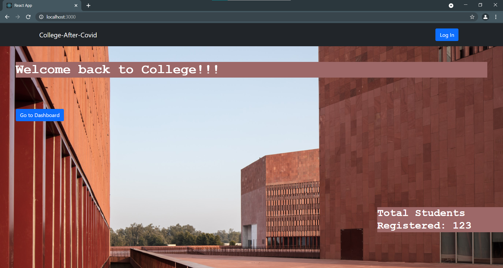
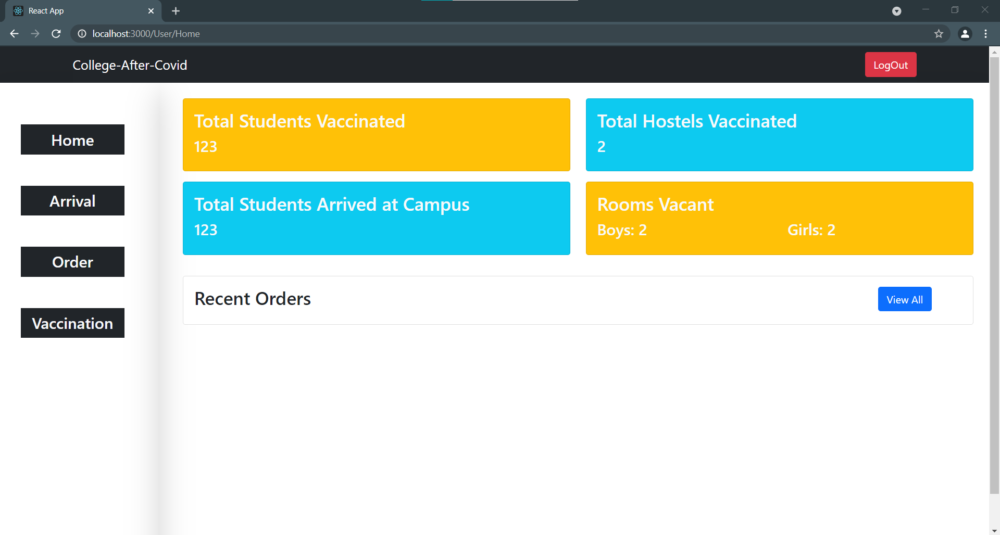
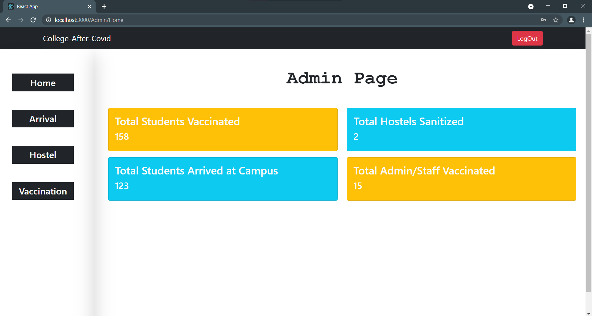

<!-- ## Project Name & Pitch -->
<h1>College After Covid</h1>
<!-- #### Example: -->

<!-- TweetWorld  -->
<!-- <h3>Tag line:</h3> -->
<!-- An application used to filter data form Twitter based on user preference, built with React, Redux, JavaScript, and CSS. -->
<h3>Welcome back to College </h3>
<!-- ## Project Status -->
<!-- (only necessary if incomplete) -->

<!-- #### Example: -->
<!-- <h4>OnB</h4> -->
<!-- This project is currently in development. Users can filter tweets by username and keyword and see visual data representation. Functionality to sort by additional parameters is in progress. -->
<h3>Project Idea:</h3>
<p>
We are working on providing a database management system to the colleges once they open after the pandemic , with the help of which they will be able to precisely keep track of the vaccinated students, hostel sanitation and how much students they can accommodate, If social distancing is to be practised.
</p>
## Project Screen Shot(s)

<!-- #### Example: -->

<h3>OnBoarding Page</h3>
<p align="center" >
  
  <!--  -->
</p>

<!-- 
<p align="center">
  <a href="https://github.com/Coder-Bhai/covid19-VijayApp">
    
  </a>
</p> -->

<h3>User Page</h3>
<p  align="center">
 <!-- <a href="https://github.com/Coder-Bhai/covid19-VijayApp"> -->
    <!--  -->
  <!-- </a> -->
  
  <!--  -->
</p>

<h3>Admin Page</h3>
<p  align="center">
  
  <!--  -->
</p>
<!-- [ PRETEND SCREEN SHOT IS HERE ] -->

<!--  -->
<!-- [ PRETEND OTHER SCREEN SHOT IS HERE ] -->

<h3>Tech Stack:</h3>
<p>Html, Css, Reactjs, Javascript, Bootstrap, Nodejs, Express, MongoDB
</p>

<h3>:link: Link to the Backend Repository:</h3>
<a href="https://github.com/JatinGoyal123/college_after_covid_backend">https://github.com/JatinGoyal123/college_after_covid_backend</a>

<h3>
Future Scope:
</h3>
<p>
When the colleges will reopen, then this can be used to track the number of hostel sanitised, to view the number of students arrived. Keeping in view the safety of the students and staff this can be used.
</p>


<p align="center">
  Show some love 💜 and Star ⭐️ the Repository to support the project.
</p>


## :rocket: Installation and Setup Instructions

#### Example:

You can get the College After Covid Web App up and running on your localhost in 5 minutes with these four steps:

1. **Clone down this repository. You will need `node` and `npm` installed globally on your machine.**
2. **Installation:**
```npm install```
3. **To Start Server:**
```npm start```
4. **To Visit App:**
```localhost:3000/```

## :purple_heart: Thanks

Thanks to all contributors and to sponsors for supporting the project.
<!--
## Reflection

  - What was the context for this project? (ie: was this a side project? was this for Turing? was this for an experiment?)
  - What did you set out to build?
  - Why was this project challenging and therefore a really good learning experience?
  - What were some unexpected obstacles?
  - What tools did you use to implement this project?
      - This might seem obvious because you are IN this codebase, but to all other humans now is the time to talk about why you chose webpack instead of create react app, or D3, or vanilla JS instead of a framework etc. Brag about your choices and justify them here.   -->

<!-- #### Example:

This was a 3 week long project built during my third module at Turing School of Software and Design. Project goals included using technologies learned up until this point and familiarizing myself with documentation for new features.

Originally I wanted to build an application that allowed users to pull data from the Twitter API based on what they were interested in, such as 'most tagged users'. I started this process by using the `create-react-app` boilerplate, then adding `react-router-4.0` and `redux`.

One of the main challenges I ran into was Authentication. This lead me to spend a few days on a research spike into OAuth, Auth0, and two-factor authentication using Firebase or other third parties. Due to project time constraints, I had to table authentication and focus more on data visualization from parts of the API that weren't restricted to authenticated users.

At the end of the day, the technologies implemented in this project are React, React-Router 4.0, Redux, LoDash, D3, and a significant amount of VanillaJS, JSX, and CSS. I chose to use the `create-react-app` boilerplate to minimize initial setup and invest more time in diving into weird technological rabbit holes. In the next iteration I plan on handrolling a `webpack.config.js` file to more fully understand the build process. -->
